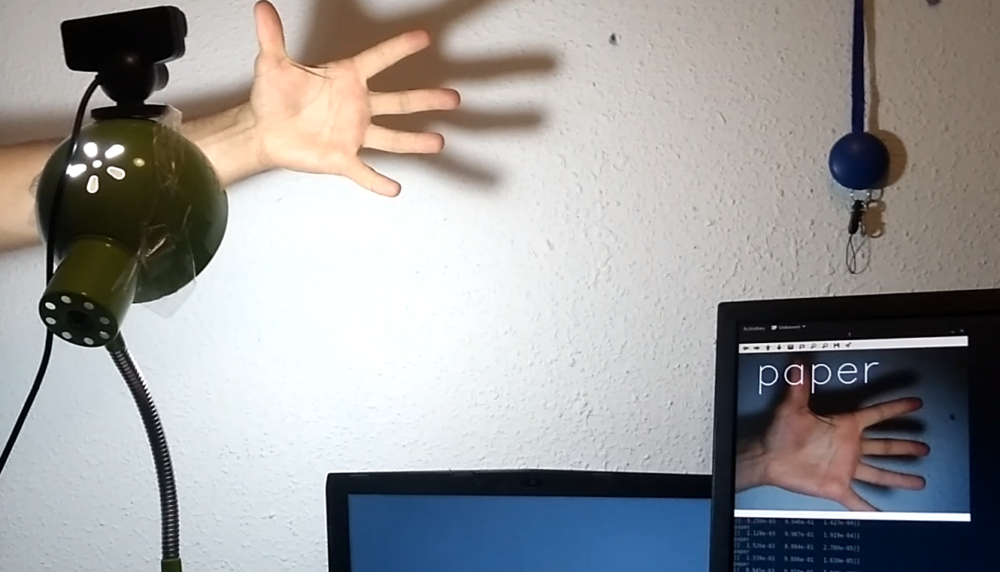
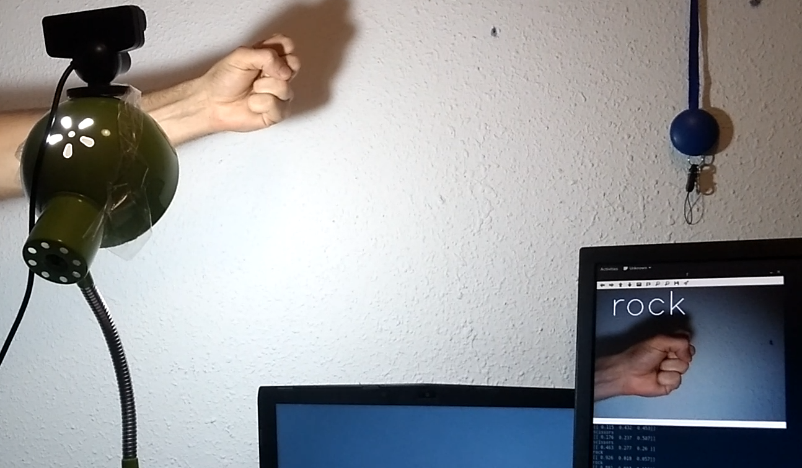
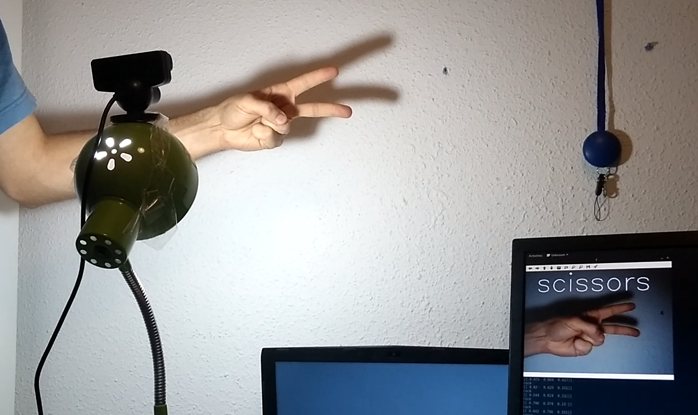

# Janken classifier.

The net works best when the hand occupies ~75% of the image. Most of the training dataset was
recorded using a PlayStation Eye.
It works on other cameras but on the PSEye works noticeably better.

## Dependencies.

* Numpy
* Keras, with TensorFlow and h5py
* OpenCV

## Samples

## The dataset. 
You can get the dataset here.

## The weights. 
You can get the weights here.
 

